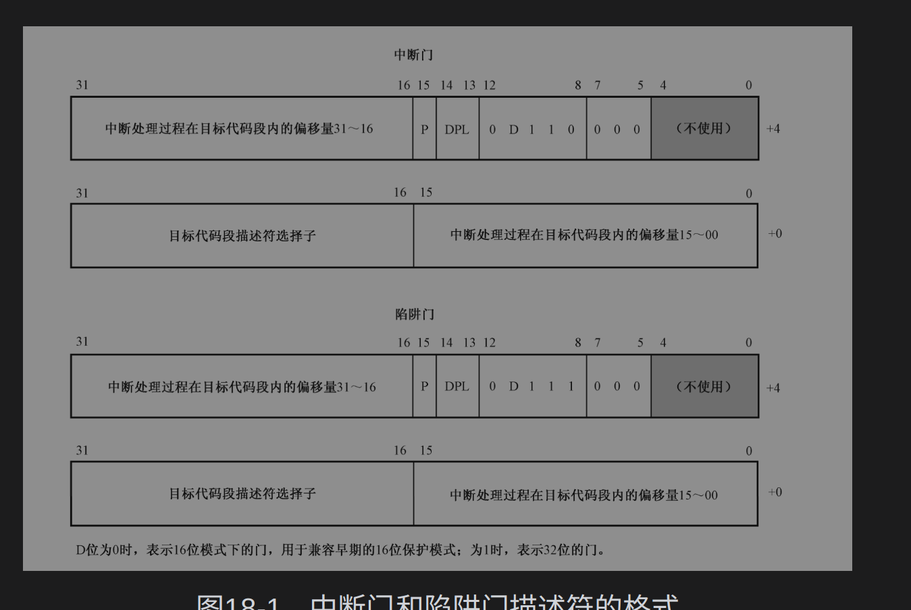
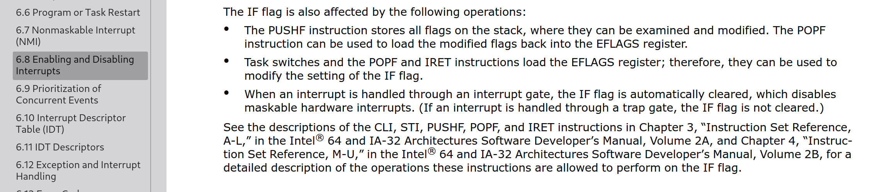

# x64 linux 内核中断

## 初始化

### 设置中断门
x86 idt.c  idt_setup_apic_and_irq_gates函数设置外部中断的中断门。外部中断触发irq_entries_start+offset位置的函数


idt_descr变量保存了idt_table的指针。

```c

gate_desc idt_table[IDT_ENTRIES] __page_aligned_bss;

struct desc_ptr idt_descr __ro_after_init = {
	.size		= (IDT_ENTRIES * 2 * sizeof(unsigned long)) - 1,
	.address	= (unsigned long) idt_table,
};


void __init idt_setup_apic_and_irq_gates(void)
{
	int i = FIRST_EXTERNAL_VECTOR;
	void *entry;

	idt_setup_from_table(idt_table, apic_idts, ARRAY_SIZE(apic_idts), true);

	// 从system_vectors bitmap 找到为为填充的idt table。idt_table[i] = irq_entries_start + 8 * (i - FIRST_EXTERNAL_VECTOR) 前32各idt已经被填充，所以idt_table[33] = irq_entries_start,idt_table[33] = irq_entries_start+8
	for_each_clear_bit_from(i, system_vectors, FIRST_SYSTEM_VECTOR) {
		entry = irq_entries_start + 8 * (i - FIRST_EXTERNAL_VECTOR);
		set_intr_gate(i, entry);
	}

```
load_idt函数调用汇编指令lidt设置idt寄存器存放idt_table变量的地址

```
void __init idt_setup_early_traps(void)
{
	idt_setup_from_table(idt_table, early_idts, ARRAY_SIZE(early_idts),
			     true);
	load_idt(&idt_descr);
}

```

### 设置vector
platform设备初始化时固件dt或者acpi静态分配了硬件中断号。
pci设备初始化时从配置空间读出硬件中断号。

以一个xhci(eXtensible Host Controller Interfac),它是一个支持usb3.0的usb主控制器。xhci-pci是一个
挂载在pci总线上的pci设备，它连接了usb root hub 和pci总线。中断是pci msi中断,si是message signaled interrupt,是一种虚拟中断，pci设备被分配了一个专门的内存地址，向内存地址写数据，将导致一个中断信息被发送给local apic,而不是像传统中断那样，通过pin脚触发经过io-apic分发给local-apic,msi地址可以认为就是中断源的hwirq号。

上电时 root pci总线遍历所有插槽注册pci设备到pci总线。

xhci-pci驱动注册到pci bus,遍历所有的pci设备，匹配，则调用xhci_pci_probe函数进行初始化。


分配irq_desc并添加到基数树的调用栈。

irq_insert_desc(unsigned int irq, struct irq_desc * desc) (/home/wang/program/linux/kernel/irq/irqdesc.c:351)
alloc_descs(const struct irq_affinity_desc * affinity, int node) (/home/wang/program/linux/kernel/irq/irqdesc.c:503)
__irq_alloc_descs(int irq, unsigned int from, unsigned int cnt, int node, struct module * owner, const struct irq_affinity_desc * affinity) (/home/wang/program/linux/kernel/irq/irqdesc.c:805)
irq_domain_alloc_descs(int virq, unsigned int cnt, irq_hw_number_t hwirq, int node, const struct irq_affinity_desc * affinity) (/home/wang/program/linux/kernel/irq/irqdomain.c:1022)
__irq_domain_alloc_irqs(struct irq_domain * domain, int irq_base, unsigned int nr_irqs, int node, void * arg, bool realloc, const struct irq_affinity_desc * affinity) (/home/wang/program/linux/kernel/irq/irqdomain.c:1341)
msi_domain_alloc_irqs(struct irq_domain * domain, struct device * dev, int nvec) (/home/wang/program/linux/include/linux/device.h:1354)
native_setup_msi_irqs(struct pci_dev * dev, int nvec, int type) (/home/wang/program/linux/arch/x86/kernel/apic/msi.c:79)
msix_capability_init() (/home/wang/program/linux/drivers/pci/msi.c:794)
__pci_enable_msix() (/home/wang/program/linux/drivers/pci/msi.c:1002)
__pci_enable_msix_range() (/home/wang/program/linux/drivers/pci/msi.c:1137)
__pci_enable_msix_range(struct pci_dev * dev, struct msix_entry * entries, int minvec, int maxvec, struct irq_affinity * affd, int flags) (/home/wang/program/linux/drivers/pci/msi.c:1116)
pci_alloc_irq_vectors_affinity(struct pci_dev * dev, unsigned int min_vecs, unsigned int max_vecs, unsigned int flags, struct irq_affinity * affd) (/home/wang/program/linux/drivers/pci/msi.c:1212)
pci_alloc_irq_vectors() (/home/wang/program/linux/include/linux/pci.h:1775)
xhci_setup_msix() (/home/wang/program/linux/drivers/usb/host/xhci.c:338)
xhci_try_enable_msi() (/home/wang/program/linux/drivers/usb/host/xhci.c:426)
xhci_run(struct usb_hcd * hcd) (/home/wang/program/linux/drivers/usb/host/xhci.c:651)
usb_add_hcd(struct usb_hcd * hcd, unsigned int irqnum, unsigned long irqflags) (/home/wang/program/linux/drivers/usb/core/hcd.c:2794)
usb_hcd_pci_probe(struct pci_dev * dev, const struct pci_device_id * id) (/home/wang/program/linux/drivers/usb/core/hcd-pci.c:270)
xhci_pci_probe(struct pci_dev * dev, const struct pci_device_id * id) (/home/wang/program/linux/drivers/usb/host/xhci-pci.c:331)
local_pci_probe(void * _ddi) (/home/wang/program/linux/drivers/pci/pci-driver.c:306)
pci_call_probe() (/home/wang/program/linux/drivers/pci/pci-driver.c:360)
__pci_device_probe() (/home/wang/program/linux/drivers/pci/pci-driver.c:385)
pci_device_probe(struct device * dev) (/home/wang/program/linux/drivers/pci/pci-driver.c:430)
really_probe(struct device * dev, struct device_driver * drv) (/home/wang/program/linux/drivers/base/dd.c:548)
driver_probe_device(struct device_driver * drv, struct device * dev) (/home/wang/program/linux/drivers/base/dd.c:721)
device_driver_attach(struct device_driver * drv, struct device * dev) (/home/wang/program/linux/drivers/base/dd.c:995)
__driver_attach(struct device * dev, void * data) (/home/wang/program/linux/drivers/base/dd.c:1072)
bus_for_each_dev(struct bus_type * bus, struct device * start, void * data, int (*)(struct device *, void *) fn) (/home/wang/program/linux/drivers/base/bus.c:304)
driver_attach(struct device_driver * drv) (/home/wang/program/linux/drivers/base/dd.c:1088)
bus_add_driver(struct device_driver * drv) (/home/wang/program/linux/drivers/base/bus.c:621)
driver_register(struct device_driver * drv) (/home/wang/program/linux/drivers/base/driver.c:170)
do_one_initcall(initcall_t fn) (/home/wang/program/linux/init/main.c:938)
do_initcall_level() (/home/wang/program/linux/init/main.c:1006)
do_initcalls() (/home/wang/program/linux/init/main.c:1014)
do_basic_setup() (/home/wang/program/linux/init/main.c:1031)
kernel_init_freeable() (/home/wang/program/linux/init/main.c:1191)
kernel_init(void * unused) (/home/wang/program/linux/init/main.c:1109)
ret_from_fork() (/home/wang/program/linux/arch/x86/entry/entry_64.S:352)
[Unknown/Just-In-Time compiled code] (Unknown Source:0)

```c


int __irq_domain_alloc_irqs(struct irq_domain *domain, int irq_base,
			    unsigned int nr_irqs, int node, void *arg,
			    bool realloc, const struct irq_affinity_desc *affinity)
{
	int i, ret, virq;


	if (realloc && irq_base >= 0) {
		virq = irq_base;
	} else {
		// 根据allocated_irqs bitmap找到未用的虚拟irq号，分配irq_desc,插入到irq_desc_tree树
		virq = irq_domain_alloc_descs(irq_base, nr_irqs, 0, node,
					      affinity);
		if (virq < 0) {
			pr_debug("cannot allocate IRQ(base %d, count %d)\n",
				 irq_base, nr_irqs);
			return virq;
		}
	}
	
	if (irq_domain_alloc_irq_data(domain, virq, nr_irqs)) {
		pr_debug("cannot allocate memory for IRQ%d\n", virq);
		ret = -ENOMEM;
		goto out_free_desc;
	}

	mutex_lock(&irq_domain_mutex);
	mylog("hwirq:%lu\n",irq_to_desc(virq)->irq_data.hwirq);
	// 设置irq_desc->irq_data的hwirq值
	ret = irq_domain_alloc_irqs_hierarchy(domain, virq, nr_irqs, arg);
	mylog("hwirq:%lu\n",irq_to_desc(virq)->irq_data.hwirq);
	if (ret < 0) {
		mutex_unlock(&irq_domain_mutex);
		goto out_free_irq_data;
	}

	for (i = 0; i < nr_irqs; i++)
		irq_domain_insert_irq(virq + i);
	mutex_unlock(&irq_domain_mutex);
	
	return virq;

out_free_irq_data:
	irq_domain_free_irq_data(virq, nr_irqs);
out_free_desc:
	irq_free_descs(virq, nr_irqs);
	return ret;
}

```

```c
int irq_domain_alloc_irqs_hierarchy(struct irq_domain *domain,
				    unsigned int irq_base,
				    unsigned int nr_irqs, void *arg)
{
	return domain->ops->alloc(domain, irq_base, nr_irqs, arg);
}
```
msi domain 的alloc 函数是

```c
static int msi_domain_alloc(struct irq_domain *domain, unsigned int virq,
			    unsigned int nr_irqs, void *arg)
{
	struct msi_domain_info *info = domain->host_data;
	struct msi_domain_ops *ops = info->ops;
	// 得到msi 地址做硬件中断号
	irq_hw_number_t hwirq = ops->get_hwirq(info, arg);
	int i, ret;

	if (irq_find_mapping(domain, hwirq) > 0)
		return -EEXIST;

	if (domain->parent) {
		ret = irq_domain_alloc_irqs_parent(domain, virq, nr_irqs, arg);
		if (ret < 0)
			return ret;
	}

	for (i = 0; i < nr_irqs; i++) {
		ret = ops->msi_init(domain, info, virq + i, hwirq + i, arg);
		if (ret < 0) {
			if (ops->msi_free) {
				for (i--; i > 0; i--)
					ops->msi_free(domain, info, virq + i);
			}
			irq_domain_free_irqs_top(domain, virq, nr_irqs);
			return ret;
		}
	}

	return 0;
}
```

get_hwirq函数指针指向

```c
static irq_hw_number_t pci_msi_get_hwirq(struct msi_domain_info *info,
					 msi_alloc_info_t *arg)
{
	return arg->msi_hwirq;
}

```
 arg参数被msi_domain_alloc_irqs函数调用ops->set_desc(&arg, desc)初始化。

 set_desc指针指向

 ```c
void pci_msi_set_desc(msi_alloc_info_t *arg, struct msi_desc *desc)
{
	arg->msi_hwirq = pci_msi_domain_calc_hwirq(arg->msi_dev, desc);
}
 ```


```c
/**
 * pci_msi_domain_calc_hwirq - Generate a unique ID for an MSI source
 * @dev:	Pointer to the PCI device
 * @desc:	Pointer to the MSI descriptor
 *
 * The ID number is only used within the irqdomain.
 */
irq_hw_number_t pci_msi_domain_calc_hwirq(struct pci_dev *dev,
					  struct msi_desc *desc)
{
	return (irq_hw_number_t)desc->msi_attrib.entry_nr |
		pci_dev_id(dev) << 11 |
		(pci_domain_nr(dev->bus) & 0xFFFFFFFF) << 27;
}
```


request_irq函数设置中断处理函数到irq_desc->action列表是要更新irq_vector，并更新per_cpu全局变量。vector_irq 数组

调用栈
apic_update_vector(struct irq_data * irqd, unsigned int newvec, unsigned int newcpu) (/home/wang/program/linux/arch/x86/kernel/apic/vector.c:175)
assign_vector_locked(struct irq_data * irqd, const struct cpumask * dest) (/home/wang/program/linux/arch/x86/kernel/apic/vector.c:253)
assign_irq_vector_any_locked() (/home/wang/program/linux/arch/x86/kernel/apic/vector.c:289)
activate_reserved() (/home/wang/program/linux/arch/x86/kernel/apic/vector.c:390)
x86_vector_activate(struct irq_domain * dom, struct irq_data * irqd, bool reserve) (/home/wang/program/linux/arch/x86/kernel/apic/vector.c:461)
__irq_domain_activate_irq(struct irq_data * irqd, bool reserve) (/home/wang/program/linux/kernel/irq/irqdomain.c:1630)
__irq_domain_activate_irq(struct irq_data * irqd, bool reserve) (/home/wang/program/linux/kernel/irq/irqdomain.c:1627)
irq_domain_activate_irq(struct irq_data * irq_data, bool reserve) (/home/wang/program/linux/kernel/irq/irqdomain.c:1653)
irq_activate(struct irq_desc * desc) (/home/wang/program/linux/kernel/irq/chip.c:291)
__setup_irq(unsigned int irq, struct irq_desc * desc, struct irqaction * new) (/home/wang/program/linux/kernel/irq/manage.c:1532)
request_threaded_irq(irq_handler_t handler) (/home/wang/program/linux/kernel/irq/manage.c:2029)
request_threaded_irq(unsigned int irq, irq_handler_t handler, irq_handler_t thread_fn, unsigned long irqflags, const char * devname, void * dev_id) (/home/wang/program/linux/kernel/irq/manage.c:1974)
request_irq() (/home/wang/program/linux/include/linux/interrupt.h:147)
xhci_setup_msix() (/home/wang/program/linux/drivers/usb/host/xhci.c:347)
xhci_try_enable_msi() (/home/wang/program/linux/drivers/usb/host/xhci.c:426)
xhci_run(struct usb_hcd * hcd) (/home/wang/program/linux/drivers/usb/host/xhci.c:651)
usb_add_hcd(struct usb_hcd * hcd, unsigned int irqnum, unsigned long irqflags) (/home/wang/program/linux/drivers/usb/core/hcd.c:2794)
usb_hcd_pci_probe(struct pci_dev * dev, const struct pci_device_id * id) (/home/wang/program/linux/drivers/usb/core/hcd-pci.c:270)
xhci_pci_probe(struct pci_dev * dev, const struct pci_device_id * id) (/home/wang/program/linux/drivers/usb/host/xhci-pci.c:331)
local_pci_probe(void * _ddi) (/home/wang/program/linux/drivers/pci/pci-driver.c:306)
pci_call_probe() (/home/wang/program/linux/drivers/pci/pci-driver.c:360)
__pci_device_probe() (/home/wang/program/linux/drivers/pci/pci-driver.c:385)
pci_device_probe(struct device * dev) (/home/wang/program/linux/drivers/pci/pci-driver.c:431)
really_probe(struct device * dev, struct device_driver * drv) (/home/wang/program/linux/drivers/base/dd.c:548)
driver_probe_device(struct device_driver * drv, struct device * dev) (/home/wang/program/linux/drivers/base/dd.c:721)
device_driver_attach(struct device_driver * drv, struct device * dev) (/home/wang/program/linux/drivers/base/dd.c:995)
__driver_attach(struct device * dev, void * data) (/home/wang/program/linux/drivers/base/dd.c:1072)
bus_for_each_dev(struct bus_type * bus, struct device * start, void * data, int (*)(struct device *, void *) fn) (/home/wang/program/linux/drivers/base/bus.c:304)
driver_attach(struct device_driver * drv) (/home/wang/program/linux/drivers/base/dd.c:1088)
bus_add_driver(struct device_driver * drv) (/home/wang/program/linux/drivers/base/bus.c:621)
driver_register(struct device_driver * drv) (/home/wang/program/linux/drivers/base/driver.c:170)
do_one_initcall(initcall_t fn) (/home/wang/program/linux/init/main.c:938)
do_initcall_level() (/home/wang/program/linux/init/main.c:1006)
do_initcalls() (/home/wang/program/linux/init/main.c:1014)
do_basic_setup() (/home/wang/program/linux/init/main.c:1031)
kernel_init_freeable() (/home/wang/program/linux/init/main.c:1191)
kernel_init(void * unused) (/home/wang/program/linux/init/main.c:1109)
ret_from_fork() (/home/wang/program/linux/arch/x86/entry/entry_64.S:352)
[Unknown/Just-In-Time compiled code] (Unknown Source:0)


```c
static int xhci_setup_msix(struct xhci_hcd *xhci)
{
	int i, ret = 0;
	struct usb_hcd *hcd = xhci_to_hcd(xhci);
	struct pci_dev *pdev = to_pci_dev(hcd->self.controller);

	/*
	 * calculate number of msi-x vectors supported.
	 * - HCS_MAX_INTRS: the max number of interrupts the host can handle,
	 *   with max number of interrupters based on the xhci HCSPARAMS1.
	 * - num_online_cpus: maximum msi-x vectors per CPUs core.
	 *   Add additional 1 vector to ensure always available interrupt.
	 */
	xhci->msix_count = min(num_online_cpus() + 1,
				HCS_MAX_INTRS(xhci->hcs_params1));

	ret = pci_alloc_irq_vectors(pdev, xhci->msix_count, xhci->msix_count,
			PCI_IRQ_MSIX);
	if (ret < 0) {
		xhci_dbg_trace(xhci, trace_xhci_dbg_init,
				"Failed to enable MSI-X");
		return ret;
	}

	for (i = 0; i < xhci->msix_count; i++) {
		// 为xhci 上的所有msi中断irq回调函数
		ret = request_irq(pci_irq_vector(pdev, i), xhci_msi_irq, 0,
				"xhci_hcd", xhci_to_hcd(xhci));
		if (ret)
			goto disable_msix;
	}

	hcd->msix_enabled = 1;
	return ret;

disable_msix:
	xhci_dbg_trace(xhci, trace_xhci_dbg_init, "disable MSI-X interrupt");
	while (--i >= 0)
		free_irq(pci_irq_vector(pdev, i), xhci_to_hcd(xhci));
	pci_free_irq_vectors(pdev);
	return ret;
}
```
* 2,调用request_threaded_irq 新建action并设置handler。
```c
int request_threaded_irq(unsigned int irq, irq_handler_t handler,
			 irq_handler_t thread_fn, unsigned long irqflags,
			 const char *devname, void *dev_id)
{
	struct irqaction *action;
	struct irq_desc *desc;

	mylog("request irq:%d\n",irq);
	desc = irq_to_desc(irq);

	action = kzalloc(sizeof(struct irqaction), GFP_KERNEL);
	if (!action)
		return -ENOMEM;

	action->handler = handler;
	action->thread_fn = thread_fn;
	action->flags = irqflags;
	action->name = devname;
	action->dev_id = dev_id;
	// 添加action 到irq_desc的action链表
	retval = __setup_irq(irq, desc, action);

```
* 3,__setup_irq()函数将action添加到desc的action链表的最后。


* 4,assign_vector_locked得到未用的vector值

```c
static int
assign_vector_locked(struct irq_data *irqd, const struct cpumask *dest)
{
	struct apic_chip_data *apicd = apic_chip_data(irqd);
	bool resvd = apicd->has_reserved;
	unsigned int cpu = apicd->cpu;
	int vector = apicd->vector;

	lockdep_assert_held(&vector_lock);

	/*
	 * If the current target CPU is online and in the new requested
	 * affinity mask, there is no point in moving the interrupt from
	 * one CPU to another.
	 */
	if (vector && cpu_online(cpu) && cpumask_test_cpu(cpu, dest))
		return 0;

	/*
	 * Careful here. @apicd might either have move_in_progress set or
	 * be enqueued for cleanup. Assigning a new vector would either
	 * leave a stale vector on some CPU around or in case of a pending
	 * cleanup corrupt the hlist.
	 */
	if (apicd->move_in_progress || !hlist_unhashed(&apicd->clist))
		return -EBUSY;
	// 得到注册中断最少的cpu，并从vector_matrix的位图中找到未用的vector。
	vector = irq_matrix_alloc(vector_matrix, dest, resvd, &cpu);
	trace_vector_alloc(irqd->irq, vector, resvd, vector);
	if (vector < 0)
		return vector;
	// 把irq_desc写道全局per_cpu vector i中。
	apic_update_vector(irqd, vector, cpu);
	// 把vector写到
	apic_update_irq_cfg(irqd, vector, cpu);

	return 0;
}

```

* 5,apic_update_vector去更新vector_irq。
```c
static void apic_update_vector(struct irq_data *irqd, unsigned int newvec,
			       unsigned int newcpu)
{

setnew:
	apicd->vector = newvec;
	apicd->cpu = newcpu;
	BUG_ON(!IS_ERR_OR_NULL(per_cpu(vector_irq, newcpu)[newvec]));
	mylog("newcpu:%d newvec:%d desc->irq_data irq:%u hwirq:%lu\n",
	newcpu,newvec,desc->irq_data.irq,desc->irq_data.hwirq);
	per_cpu(vector_irq, newcpu)[newvec] = desc;
}

```

6,apic_update_irq_cfg函数保存vector 在irq_desc->irq_data.chip_data->hw_irq_cfg.vector中。

```c
static void apic_update_irq_cfg(struct irq_data *irqd, unsigned int vector,
				unsigned int cpu)
{
	struct apic_chip_data *apicd = apic_chip_data(irqd);

	lockdep_assert_held(&vector_lock);

	apicd->hw_irq_cfg.vector = vector;
	apicd->hw_irq_cfg.dest_apicid = apic->calc_dest_apicid(cpu);
	irq_data_update_effective_affinity(irqd, cpumask_of(cpu));
	trace_vector_config(irqd->irq, vector, cpu,
			    apicd->hw_irq_cfg.dest_apicid);
}

```

## 中断触发 


汇编代码重复256-32次，压栈vector,vector初始值32,每次重复递增。代码片段大小<=8,按8字节对齐。所以
irq_entries_start+n * 8就是每段代码的入口。这被初始化设置到idt中。

linux x86不支持中断抢占，所以外部中断都跳到了common_interrupt。
当外部io触发时，自动clear EFLAGS IF标志位,屏蔽所有可屏蔽中断并跳转到irq_entries_start。



```assembly
/*
 * Build the entry stubs with some assembler magic.
 * We pack 1 stub into every 8-byte block.
 */
	.align 8
ENTRY(irq_entries_start)
    vector=FIRST_EXTERNAL_VECTOR
    .rept (FIRST_SYSTEM_VECTOR - FIRST_EXTERNAL_VECTOR)
	UNWIND_HINT_IRET_REGS
	pushq	$(~vector+0x80)			/* Note: always in signed byte range */
	jmp	common_interrupt
	.align	8
	vector=vector+1
    .endr
END(irq_entries_start)# 内核中断


```

irq_entries_start 跳转到common_interrupt
```assysmbol
common_interrupt:
	addq	$-0x80, (%rsp)			/* Adjust vector to [-256, -1] range */
	call	interrupt_entry
	UNWIND_HINT_REGS indirect=1
	call	do_IRQ	/* rdi points to pt_regs */
	/* 0(%rsp): old RSP */
ret_from_intr:
	DISABLE_INTERRUPTS(CLBR_ANY)
	TRACE_IRQS_OFF

	LEAVE_IRQ_STACK

	testb	$3, CS(%rsp)
	jz	retint_kernel
```

common_interrupt 调用do_IRQ。do_IRQ得到中断向量号，并从irqvector得到desc。

```c
__visible unsigned int __irq_entry do_IRQ(struct pt_regs *regs)
{
	struct pt_regs *old_regs = set_irq_regs(regs);
	struct irq_desc * desc;
	/* high bit used in ret_from_ code  */
	unsigned vector = ~regs->orig_ax;

	entering_irq();

	/* entering_irq() tells RCU that we're not quiescent.  Check it. */
	RCU_LOCKDEP_WARN(!rcu_is_watching(), "IRQ failed to wake up RCU");

	desc = __this_cpu_read(vector_irq[vector]);
	if (likely(!IS_ERR_OR_NULL(desc))) {
		if (IS_ENABLED(CONFIG_X86_32))
			handle_irq(desc, regs);
		else
			generic_handle_irq_desc(desc);
	} else {
		ack_APIC_irq();

		if (desc == VECTOR_UNUSED) {
			pr_emerg_ratelimited("%s: %d.%d No irq handler for vector\n",
					     __func__, smp_processor_id(),
					     vector);
		} else {
			__this_cpu_write(vector_irq[vector], VECTOR_UNUSED);
		}
	}

	exiting_irq();

	set_irq_regs(old_regs);
	return 1;
}

```

do_IRQ entering_irq()进入中断上下文，entering_irq()调用了preempt_count_add(HARDIRQ_OFFSET)，增加计数
```c
#define __irq_enter()					\
	do {						\
		account_irq_enter_time(current);	\
		preempt_count_add(HARDIRQ_OFFSET);	\
		trace_hardirq_enter();			\
	} while (0)

```
per_cpu 变量``` DEFINE_PER_CPU(int, __preempt_count) = INIT_PREEMPT_COUNT;```

/*
 * We put the hardirq and softirq counter into the preemption
 * counter. The bitmask has the following meaning:
 *
 * - bits 0-7 are the preemption count (max preemption depth: 256)
 * - bits 8-15 are the softirq count (max # of softirqs: 256)
 *
 * The hardirq count could in theory be the same as the number of
 * interrupts in the system, but we run all interrupt handlers with
 * interrupts disabled, so we cannot have nesting interrupts. Though
 * there are a few palaeontologic drivers which reenable interrupts in
 * the handler, so we need more than one bit here.
 *
 *         PREEMPT_MASK:	0x000000ff
 *         SOFTIRQ_MASK:	0x0000ff00
 *         HARDIRQ_MASK:	0x000f0000
 *             NMI_MASK:	0x00100000
 * PREEMPT_NEED_RESCHED:	0x80000000
 */

 HARDIRQ_MASK 作为掩码标记了硬件中断计数占用了四位，最大为15,进入硬件中断则硬件中断嵌套计数加1，上面复制的代码注释显示，理论上hard_irq可以为不小于15的值，但是所有的中断处理中都禁用了中断，所以hardirq_count只能为0或者1,<font color=Red>硬件中断不能嵌套硬件中断</font>。
 SOFTIRQ_MASK 作为掩码标记了软件中断计数占用了8位。

 所以可使用下列宏判断上下文中状态
 #define in_irq()		(hardirq_count())
#define in_softirq()		(softirq_count())
#define in_interrupt()		(irq_count())
#define in_serving_softirq()	(softirq_count() & SOFTIRQ_OFFSET)
#define in_nmi()		(preempt_count() & NMI_MASK)
#define in_task()		(!(preempt_count() & \
				   (NMI_MASK | HARDIRQ_MASK | SOFTIRQ_OFFSET)))

用宏irqs_disabled() 判断EFLAGS是否为零(中断屏蔽);
hardirq_count 计数非0在硬件中断上下文中。即中断处理的上半部分。
### 硬中断上下文
do_IRQ,得到 vector,进而得到desc
```c
		if (IS_ENABLED(CONFIG_X86_32))
			handle_irq(desc, regs);
		else
			generic_handle_irq_desc(desc);
```

一个硬中断irq调用栈
usb_hcd_irq(int irq, void * __hcd) (/home/wang/program/linux/drivers/usb/core/hcd.c:2324)
__handle_irq_event_percpu(struct irq_desc * desc, unsigned int * flags) (/home/wang/program/linux/kernel/irq/handle.c:149)
handle_irq_event_percpu(struct irq_desc * desc) (/home/wang/program/linux/kernel/irq/handle.c:189)
handle_irq_event(struct irq_desc * desc) (/home/wang/program/linux/kernel/irq/handle.c:206)
handle_fasteoi_irq(struct irq_desc * desc) (/home/wang/program/linux/kernel/irq/chip.c:725)
generic_handle_irq_desc() (/home/wang/program/linux/include/linux/irqdesc.h:156)
do_IRQ(struct pt_regs * regs) (/home/wang/program/linux/arch/x86/kernel/irq.c:250)
common_interrupt() (/home/wang/program/linux/arch/x86/entry/entry_64.S:607)
[Unknown/Just-In-Time compiled code] (Unknown Source:0)

do_IRQ()通过调用exiting_irq()调用irq_exit()

irq_exit() 对hardirq计数减一。如果hardirq计数为0。

in_interrupt()判断是否在中断上下文。如果在硬件中断上下文中，返回。如果在软件中断上下文中，说明此次硬件中断打断了一个软中断，也返回。

如果in_interrupt()为false,说明没有硬件和软件中断嵌套,这种情况下，如果per_cpu变量softirq_pending被置位，说明有待定的软中断回调要去处理。
invoke_softirq()，进入softirq.

```c
void irq_exit(void)
{
#ifndef __ARCH_IRQ_EXIT_IRQS_DISABLED
	local_irq_disable();
#else
	lockdep_assert_irqs_disabled();
#endif
	account_irq_exit_time(current);
	preempt_count_sub(HARDIRQ_OFFSET);
	if (!in_interrupt() && local_softirq_pending())
		invoke_softirq();

	tick_irq_exit();
	rcu_irq_exit();
	trace_hardirq_exit(); /* must be last! */
}

```

### 软中断上下文
invoke_softirq()调用了__do_softirq。

1,__do_softirq 得到per_cpu变量的irq_pending的值，保存为局部变量。

2,然后为SOFTIRQ_MASK标记的preempt_count置位，进入软中断上下文，in_interrupt()为false时才能调用invoke_softirq,所以<font color=Red>软中断不可嵌套软中断</font>。

3,清除per_cpu 全局变量irq_pending.

5,local_irq_enable置位IF,开启硬件中断
4,然后遍历pending所有的位，如果置位，则调用对应的softirq_action.

5,local_irq_disable 清零IF,关闭硬件中断。

6,软件中断执行过程中，可能触发了硬件中断，硬件中断设置了待处理的软件中断，但是soft_irq被禁止，in_interrupt为true,新的硬件中断返回了。所以再次检查per_cpu变量。如果有待处理的，则goto restart.

7,处理完成softirq,再次关闭硬件中断。

```c
asmlinkage __visible void __softirq_entry __do_softirq(void)
{
	unsigned long end = jiffies + MAX_SOFTIRQ_TIME;
	unsigned long old_flags = current->flags;
	int max_restart = MAX_SOFTIRQ_RESTART;
	struct softirq_action *h;
	bool in_hardirq;
	__u32 pending;
	int softirq_bit;

	/*
	 * Mask out PF_MEMALLOC as the current task context is borrowed for the
	 * softirq. A softirq handled, such as network RX, might set PF_MEMALLOC
	 * again if the socket is related to swapping.
	 */
	current->flags &= ~PF_MEMALLOC;
	
	pending = local_softirq_pending();
	account_irq_enter_time(current);

	__local_bh_disable_ip(_RET_IP_, SOFTIRQ_OFFSET);
	in_hardirq = lockdep_softirq_start();

restart:
	/* Reset the pending bitmask before enabling irqs */
	set_softirq_pending(0);

	local_irq_enable();

	h = softirq_vec;

	while ((softirq_bit = ffs(pending))) {
		unsigned int vec_nr;
		int prev_count;

		h += softirq_bit - 1;

		vec_nr = h - softirq_vec;
		prev_count = preempt_count();

		kstat_incr_softirqs_this_cpu(vec_nr);

		trace_softirq_entry(vec_nr);
		h->action(h);
		trace_softirq_exit(vec_nr);
		if (unlikely(prev_count != preempt_count())) {
			pr_err("huh, entered softirq %u %s %p with preempt_count %08x, exited with %08x?\n",
			       vec_nr, softirq_to_name[vec_nr], h->action,
			       prev_count, preempt_count());
			preempt_count_set(prev_count);
		}
		h++;
		pending >>= softirq_bit;
	}

	if (__this_cpu_read(ksoftirqd) == current)
		rcu_softirq_qs();
	local_irq_disable();

	pending = local_softirq_pending();
	if (pending) {
		if (time_before(jiffies, end) && !need_resched() &&
		    --max_restart)
			goto restart;

		wakeup_softirqd();
	}

	lockdep_softirq_end(in_hardirq);
	account_irq_exit_time(current);
	__local_bh_enable(SOFTIRQ_OFFSET);
	WARN_ON_ONCE(in_interrupt());
	current_restore_flags(old_flags, PF_MEMALLOC);
}

```

```c
// 软中断类型
enum
{
	HI_SOFTIRQ=0,
	TIMER_SOFTIRQ,
	NET_TX_SOFTIRQ,
	NET_RX_SOFTIRQ,
	BLOCK_SOFTIRQ,
	IRQ_POLL_SOFTIRQ,
	TASKLET_SOFTIRQ,
	SCHED_SOFTIRQ,
	HRTIMER_SOFTIRQ, /* Unused, but kept as tools rely on the
			    numbering. Sigh! */
	RCU_SOFTIRQ,    /* Preferable RCU should always be the last softirq */

	NR_SOFTIRQS
};

// 软中断 action 数组,oftirq_action 数组
static struct softirq_action [NR_SOFTIRQS] __cacheline_aligned_in_smp;


// 设置tasklet_action函数
open_softirq(TASKLET_SOFTIRQ, tasklet_action);。


// 遍历local_softirq_pending 列表，调用对应的action函数。
// 如果TASKLET_SOFTIRQ被置位
// tasklet_action函数调用当前tasklet列表
__do_softirq() 


```

### 中断结束
common_interrupt 调用do_IRQ()后，调用retint_kernel退出中断。


retint_kernel:
#ifdef CONFIG_PREEMPTION
	/* Interrupts are off */
	/* Check if we need preemption */
	btl	$9, EFLAGS(%rsp)		/* were interrupts off? */
	jnc	1f
	cmpl	$0, PER_CPU_VAR(__preempt_count)
	jnz	1f
	call	preempt_schedule_irq

retint_kernel调用了preempt_schedule_irq,检查是否需要立刻调用调度器，这增加了实时性，避免返回用户空间在进入内核去调度进程。

```c
/*
 * This is the entry point to schedule() from kernel preemption
 * off of irq context.
 * Note, that this is called and return with irqs disabled. This will
 * protect us against recursive calling from irq.
 */
asmlinkage __visible void __sched preempt_schedule_irq(void)
{
	enum ctx_state prev_state;

	/* Catch callers which need to be fixed */
	BUG_ON(preempt_count() || !irqs_disabled());
	prev_state = exception_enter();

	do {
		preempt_disable();
		local_irq_enable();;
		__schedule(true);
		local_irq_disable();
		sched_preempt_enable_no_resched();
	} while (need_resched());

	exception_exit(prev_state);
}
```

最终退出中断，恢复被中断打断的现场。


## 相关结构体

irq_domain ,一个中断控制器有一个irq_domain,name是中断控制器的名字，linear_revmap是此中断控制器上hwirq和irq的映射关系。parent是父节点，多个中断控制器能够嵌套构成树状结构。

```c
struct irq_domain {
	struct list_head link;
	const char *name;
	const struct irq_domain_ops *ops;
	void *host_data;
	unsigned int flags;
	unsigned int mapcount;

	/* Optional data */
	struct fwnode_handle *fwnode;
	enum irq_domain_bus_token bus_token;
	struct irq_domain_chip_generic *gc;
#ifdef	CONFIG_IRQ_DOMAIN_HIERARCHY
	struct irq_domain *parent;
#endif
#ifdef CONFIG_GENERIC_IRQ_DEBUGFS
	struct dentry		*debugfs_file;
#endif

	/* reverse map data. The linear map gets appended to the irq_domain */
	irq_hw_number_t hwirq_max;
	unsigned int revmap_direct_max_irq;
	unsigned int revmap_size;
	struct radix_tree_root revmap_tree;
	struct mutex revmap_tree_mutex;
	unsigned int linear_revmap[];
};

```

一个中断控制可能有一种或多种处理中断的操作。比如处理中断时要发送ack给中断控制器，中断函数调用完成后发送eoi结束中断处理,一个中断控制的irq_ack有两种，他就会有两个irq_chip.

```c
struct irq_chip {
	struct device	*parent_device;
	const char	*name;
	unsigned int	(*irq_startup)(struct irq_data *data);
	void		(*irq_shutdown)(struct irq_data *data);
	void		(*irq_enable)(struct irq_data *data);
	void		(*irq_disable)(struct irq_data *data);

	void		(*irq_ack)(struct irq_data *data);
	void		(*irq_mask)(struct irq_data *data);
	void		(*irq_mask_ack)(struct irq_data *data);
	void		(*irq_unmask)(struct irq_data *data);
	void		(*irq_eoi)(struct irq_data *data);

	int		(*irq_set_affinity)(struct irq_data *data, const struct cpumask *dest, bool force);
	int		(*irq_retrigger)(struct irq_data *data);
	int		(*irq_set_type)(struct irq_data *data, unsigned int flow_type);
	int		(*irq_set_wake)(struct irq_data *data, unsigned int on);

	void		(*irq_bus_lock)(struct irq_data *data);
	void		(*irq_bus_sync_unlock)(struct irq_data *data);

	void		(*irq_cpu_online)(struct irq_data *data);
	void		(*irq_cpu_offline)(struct irq_data *data);

	void		(*irq_suspend)(struct irq_data *data);
	void		(*irq_resume)(struct irq_data *data);
	void		(*irq_pm_shutdown)(struct irq_data *data);

	void		(*irq_calc_mask)(struct irq_data *data);

	void		(*irq_print_chip)(struct irq_data *data, struct seq_file *p);
	int		(*irq_request_resources)(struct irq_data *data);
	void		(*irq_release_resources)(struct irq_data *data);

	void		(*irq_compose_msi_msg)(struct irq_data *data, struct msi_msg *msg);
	void		(*irq_write_msi_msg)(struct irq_data *data, struct msi_msg *msg);

	int		(*irq_get_irqchip_state)(struct irq_data *data, enum irqchip_irq_state which, bool *state);
	int		(*irq_set_irqchip_state)(struct irq_data *data, enum irqchip_irq_state which, bool state);

	int		(*irq_set_vcpu_affinity)(struct irq_data *data, void *vcpu_info);

	void		(*ipi_send_single)(struct irq_data *data, unsigned int cpu);
	void		(*ipi_send_mask)(struct irq_data *data, const struct cpumask *dest);

	int		(*irq_nmi_setup)(struct irq_data *data);
	void		(*irq_nmi_teardown)(struct irq_data *data);

	unsigned long	flags;
};


```

一个中断源可以用中断控制器和它的硬件中断号hwirq来表示，多个中断控制器可能有重复的硬件中断号。每一个中断源对应一个虚拟中断号irq,通过虚拟中断号可以找到中断源对应的desc。
handle_irq为中断源的中断处理函数，他会调用chip的ack操作，然后遍历action链表，如果运行中断共享，action链表上有多个节点,action handler函数必须先判断是否匹配自己处理，比如通过读某些寄存器的状态，共享中断必须能够通过某种共同的操作得到不同的状态去区分，不该自己处理，直接返回IRQ_NOE。
```c
struct irq_desc {
	struct irq_common_data	irq_common_data;
	struct irq_data		irq_data;
	unsigned int __percpu	*kstat_irqs;
	irq_flow_handler_t	handle_irq;
#ifdef CONFIG_IRQ_PREFLOW_FASTEOI
	irq_preflow_handler_t	preflow_handler;
#endif
	struct irqaction	*action;	/* IRQ action list */
	unsigned int		status_use_accessors;
	unsigned int		core_internal_state__do_not_mess_with_it;
	unsigned int		depth;		/* nested irq disables */
	unsigned int		wake_depth;	/* nested wake enables */
	unsigned int		tot_count;
	unsigned int		irq_count;	/* For detecting broken IRQs */
	unsigned long		last_unhandled;	/* Aging timer for unhandled count */
	unsigned int		irqs_unhandled;
	atomic_t		threads_handled;
	int			threads_handled_last;
	raw_spinlock_t		lock;
	struct cpumask		*percpu_enabled;
	const struct cpumask	*percpu_affinity;
#ifdef CONFIG_SMP
	const struct cpumask	*affinity_hint;
	struct irq_affinity_notify *affinity_notify;
#ifdef CONFIG_GENERIC_PENDING_IRQ
	cpumask_var_t		pending_mask;
#endif
#endif
	unsigned long		threads_oneshot;
	atomic_t		threads_active;
	wait_queue_head_t       wait_for_threads;
#ifdef CONFIG_PM_SLEEP
	unsigned int		nr_actions;
	unsigned int		no_suspend_depth;
	unsigned int		cond_suspend_depth;
	unsigned int		force_resume_depth;
#endif
#ifdef CONFIG_PROC_FS
	struct proc_dir_entry	*dir;
#endif
#ifdef CONFIG_GENERIC_IRQ_DEBUGFS
	struct dentry		*debugfs_file;
	const char		*dev_name;
#endif
#ifdef CONFIG_SPARSE_IRQ
	struct rcu_head		rcu;
	struct kobject		kobj;
#endif
	struct mutex		request_mutex;
	int			parent_irq;
	struct module		*owner;
	const char		*name;
} ____cacheline_internodealigned_in_smp;

```

irq_data包含irq,hwirq,chip,domain等信息.
```c
struct irq_data {
	u32			mask;
	unsigned int		irq;
	unsigned long		hwirq;
	struct irq_common_data	*common;
	struct irq_chip		*chip;
	struct irq_domain	*domain;
#ifdef	CONFIG_IRQ_DOMAIN_HIERARCHY
	struct irq_data		*parent_data;
#endif
	void			*chip_data;
};

```

## 参考
[apic机制分析](https://www.cnblogs.com/wahaha02/p/6341095.html)